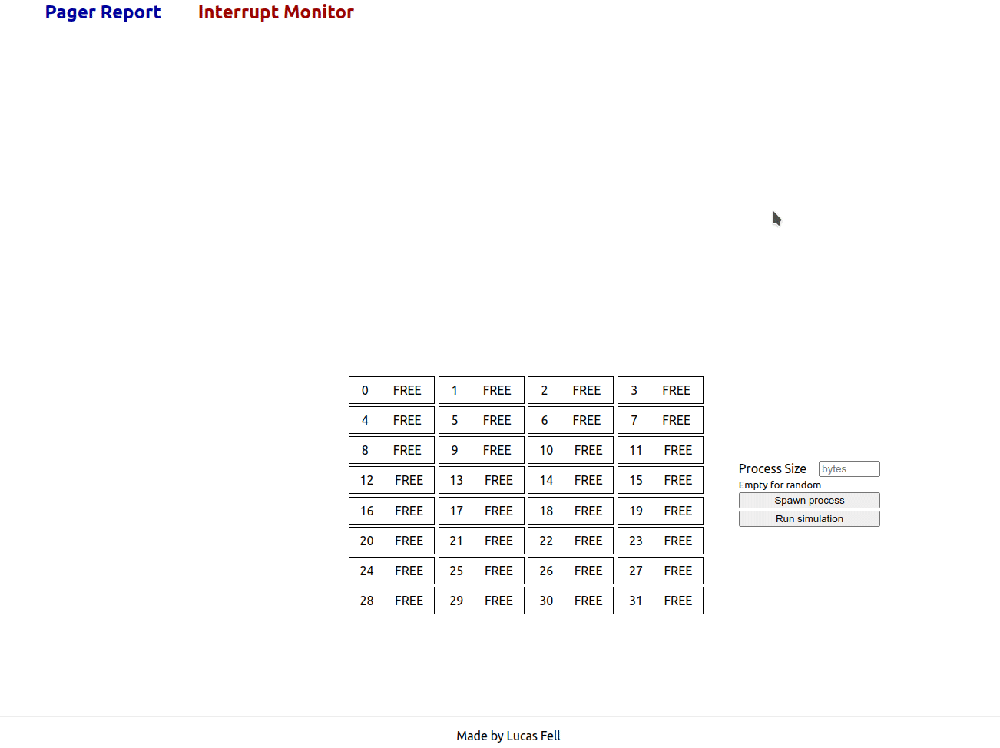

To run this project in your machine, start by installing the dependencies:

* You must have Dart SDK (`version >= 2.10.0 and < 3.0.0`) installed.

* You must also have Dart CLI tools to run **webdev**: run `dart pub global activate webdev`

```sh 
dart pub get
```
then, 
```sh
webdev serve
``` 

the local server will be available at em http://localhost:8080. 

## Description

This program simply tries to simulate the memory management that happens
under the hood in all of our computers. This simulator is definitely not accurate,
this was a project made for a subject during my Software Engineering course.

Some things I implemented: interruptions, processes and how they interact with virtual memory, pager report...

<p align="center">
  
</p>


<a href="https://github.com/fell-lucas">Author: Lucas Alexandre Fell (me)</a>